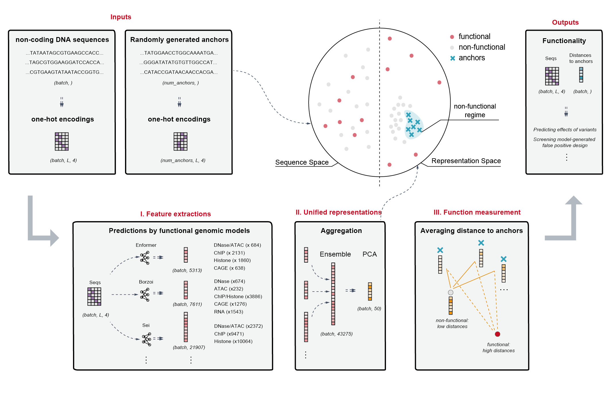

# DeepACE

*qxdu edited on May 11, 2026*

The code for computational implementation of "Anchor-based ensemble learning for assessing regulatory function of DNA sequences".

# Introduction

DeepACE (Deep Anchor-based Cis-regulatory Evaluation) is a deep learning–based framework that reinterprets 16 functional genomic models as complementary, semantically meaningful encodings of regulatory activity. DeepACE reveals a consistent geometric structure in which non-functional sequences collapse toward a compact regime, whereas functional sequences remain broadly distributed. Motivated by this asymmetry, DeepACE quantifies regulatory function as the distance from non-functional anchors, yielding a continuous, model-invariant metric without task-specific supervision. Consequently, DeepACE accurately captures the effects of sequence variation, distinguishes disease-associated variants, and eliminates non-functional synthetic candidates up to 16-fold more efficiently in sequence design tasks, while achieving leading performance across diverse benchmarking datasets and revealing interpretable functional directions within the regulatory landscape.



**Figure 1.**  Overview of the DeepACE framework 

Schematic of the DeepACE approach. Input consists of raw DNA sequences, which are first transformed into functional representations by multiple functional genomics models (I). These representations are then integrated via ensemble modeling and projected through Principal Component Analysis (PCA) into a unified representation space (i.e., URS) (II). Finally, distances to randomly sampled non-functional anchor sequences are computed to quantify regulatory function in a model-invariant manner (III). DeepACE ultimately assigns each input sequence a distance-based score reflecting its regulatory activity.


# Quick Start

1. Predictions by functional geneomic models

2. Unified representation

3. Function measurement by anchor-based distances


## Predictions by functional geneomic models

We provide fully localized support for 16 functional genomic models published between 2016 and 2025. These models span highly heterogeneous software ecosystems, including incompatible conda environments, different PyTorch/TensorFlow versions, and diverse runtime dependencies. To make these models accessible within a unified framework, DeepACE introduces several layers of standardization and engineering integration:

- **Unified model wrappers.** All models are encapsulated into a consistent class interface, with their dependencies organized under the `./libs` directory, enabling direct import and streamlined usage.

- **Environment consolidation.** The original 16 heterogeneous runtime environments are reduced to only 5 unified environments (`./envs`). In particular, a single Lightning-based environment supports 11 different models.

- **Standardized weight management.** In collaboration with original model authors, we cleaned and reorganized model checkpoints, dependencies, and auxiliary files, retaining only the essential parameters required for inference.

- **Explicit nucleotide encoding conventions.** We systematically determined and documented the exact ATCG encoding order used by each model. Although this information is critical for correct inference and interpretation, it is often obscured by complex preprocessing pipelines in the original implementations.

- **Structured output annotation.** We systematically reorganized model outputs and functional channels, allowing users to rapidly identify the biological semantics associated with any output feature from any model.

- **Built-in validation functions.** To ensure faithful reproduction, every model class includes a `quick_valid()` function. Each validation routine is linked to corresponding figures or statistical results from the original publication, allowing users to verify correct model loading and reproduction accuracy.

Detailed information for all 16 models is provided in the **Preparation** section.

### One-click Reproduction Pipeline

We first provide a one-click reproduction script \texttt{./prediction.sh}, which can be used as follows:

```
# run_unified_prediction.sh
#
# This script generates and runs model-specific Python prediction scripts
# for a set of genomics models, then merges their outputs into unified files.
#
# Usage:
#   bash run_unified_prediction.sh \
#     -i SEQS_PATH      Path to input FASTA/sequences file                \
#     -o OUTS_PATH      Path to output directory                           \
#     -t TRACKS_PATH    Path to tracks/features CSV file                  \
#     [-l LOC]          Location/mode tag for model outputs (default: center) \
#     [-d DEV]          CUDA device index (default: 0)                    \
#     [-m MODEL_INDEXES]Comma-separated list of model indices (e.g. 0,3,5; default: all) \
#     [-n|--nohup]      Relaunch entire pipeline under nohup to OUTS_PATH/nohup.out \
#     [-c|--clear]      After completion, clear all files in OUTS_PATH except uni_pred.npy, uni_anno.csv, reports.txt, script_unified.py \
```

By using this script, users only need to provide raw input sequences, and the system will automatically generate prediction results across all functional genomic models and aggregate them into unified outputs.

### Model Reproducibility

Due to GitHub repository size limitations, some reproduction assets used by the `quick_valid()` functions are provided as external references. Two simple instances for verifying model behavior using the following resources:

- **SegmentNT.**  
The original inference and visualization notebook is available at
  
`https://colab.research.google.com/#fileId=https%3A//huggingface.co/InstaDeepAI/segment_nt/blob/main/inference_segment_nt.ipynb`
  
Our reproduced result can be found at valids dataset:

`./valids/SegmentNT/predicted_features.png`

- **Enformer.**  
  For Enformer reproduction, we discussed the validation procedure with the authors of `basenji2-pytorch` and identified a practical validation benchmark discussed at https://github.com/d-laub/basenji2-pytorch/issues/1.

## Unified Representation

DeepACE integrates heterogeneous outputs from multiple functional genomic models into a shared representation space. A simplified pseudocode implementation is shown below:

```python
reps = concat(
    reps_enformer,
    reps_deepdnashape,
    ...,
    reps_puffin,
    reps_segmenNT
)

pca = PCA(n_components=50, random_state=42)
reps_pca = pca.fit_transform(reps)
```

## Function measurement by anchor-based distances

DeepACE quantifies regulatory function using anchor-based distance measurements. In practice, Mahalanobis distance is typically used to measure the distance between real sequence representations and randomly generated anchor representations, as Euclidean distance is insensitive to covariance structure in high-dimensional representation spaces.

A simplified pseudocode implementation is shown below:

```
cov = np.cov(pred_ref, rowvar=False)
cov_inv = np.linalg.pinv(cov)

sims = []

for x in pred_alt:
    dists = [-mahalanobis(x, y, cov_inv) for y in pred_ref]
    dists = np.array(dists)
    sims.append(dists.mean())

sims = np.array(sims)
sims = (sims - sims.min()) / (sims.max() - sims.min() + 1e-12)
```

Here, `pred_ref` denotes 50-dimensional embeddings of anchor-based non-functional sequences, while `pred_alt` denotes 50-dimensional embeddings of candidate regulatory sequences to be evaluated. The resulting normalized similarity score provides a continuous, model-invariant estimate of regulatory function.

# Preparation

## Environment Setup


This codebase requires a GPU-enabled environment to efficiently support deep learning model inference and training. Running on CPU is possible but may be significantly slower.

We provide two primary environments to support the full functionality of the package:

**Lightning Environment**

```
This environment supports the majority of models in the framework, like Basset and Borzoi
- CUDA: 12.2  
- Python: 3.9.6  
- PyTorch: 1.9.0  
Higher versions of Python and PyTorch are generally compatible and may also work without issues.
```

**Transformers Environment**

```
This environment is used for transformer-based models, like Enformer and SegmentNT
- CUDA: 12.2  
- Python: 3.9.12  
- PyTorch: 2.4.0+cu121  
Higher versions of Python and PyTorch are also expected to be compatible.
```

The remaining three auxiliary environments are lightweight and relatively easy to configure. The full functionality of this package relies on additional Python dependencies located in the `./envs` directory.

## Dataset Summary

| Dataset Name | Experiment Method | Cell Type | Key Factor | Length | Design Method | Description | Paper |
|--------------|------------------|------------|------------|--------|---------------|-------------|-------|
| MPRA_HepG2 | MPRA | HepG2 | - | 200 | adalead | enhancers | [1] |
| MPRA_K562 | MPRA | K562 | - | 200 | adalead | enhancers | [1] |
| MPRA_SKNSH | MPRA | SKNSH | - | 200 | adalead | enhancers | [1] |
| lentiMPRA_HepG2 | lentiMPRA | HepG2 | - | 200 | natural | enhancers | [2] |
| lentiMPRA_K562 | lentiMPRA | K562 | - | 200 | natural | enhancers | [2] |
| lentiMPRA_WTC11 | lentiMPRA | WTC11 | - | 200 | natural | enhancers | [2] |
| Epigenetics_ELF1 | MPRA | HepG2 | ELF1 | 168 | deepseed | enhancers | [3] |
| Epigenetics_HNF1A | MPRA | HepG2 | HNF1A | 168 | deepseed | enhancers | [3] |
| Epigenetics_HNF4A | MPRA | HepG2 | HNF4A | 168 | deepseed | enhancers | [3] |
| Epigenetics_118TF | MPRA | HepG2 | - | 168 | deepseed | enhancers | [3] |
| Epigenetics_train | MPRA | HepG2 | - | 168 | natural | enhancers | [3] |
| Epigenetics_motif | MPRA | HepG2 | - | 168 | perturbation | enhancers | [3] |
| MPRABase_F9 | MPRA | HepG2 | F9 | 303 | mutagenesis | promoters | [4] |
| MPRABase_GP1BA | MPRA | HEL 92.1.7 | GP1BA | 385 | mutagenesis | promoters | [4] |
| MPRABase_HBG1 | MPRA | HEL 92.1.7 | HBG1 | 274 | mutagenesis | promoters | [4] |
| MPRABase_IRF4 | MPRA | SK-MEL-28 | IRF4 | 451 | mutagenesis | enhancers | [4] |
| MPRABase_IRF6 | MPRA | HaCaT | IRF6 | 600 | mutagenesis | enhancers | [4] |
| MPRABase_LDLR | MPRA | HepG2 | LDLR | 318 | mutagenesis | promoters | [4] |
| MPRABase_PKLR | MPRA | K562 | PKLR | 470 | mutagenesis | promoters | [4] |
| MPRABase_SORT1 | MPRA | HepG2 | SORT1 | 600 | mutagenesis | enhancers | [4] |
| MPRABase_TERT | MPRA | SF7996 | TERT | 259 | mutagenesis | promoters | [4] |
| MPRABase_ZFAND3 | MPRA | MIN6 | ZFAND3 | 579 | mutagenesis | enhancers | [4] |
| SCREEN | - | - | - | 600 | natural | CREs | [5] |
| DS-lentiMPRA-M | lentiMPRA | HepG2 | - | 170 | natural | enhancers | [6] |
| DS-lentiMPRA-WT | lentiMPRA | HepG2 | - | 170 | natural | enhancers | [6] |
| DS-STARR-seq | STARR-seq | HepG2 | - | 186 | natural | enhancers | [7] |
| CRÈME_K562 | - | K562 | - | 196608 | natural | enhancers | [8] |
| CRÈME_GM12878 | - | GM12878 | - | 196608 | natural | enhancers | [8] |
| CRÈME_PC-3 | - | PC-3 | - | 196608 | natural | enhancers | [8] |
| promoterAI_clinvar | - | - | - | 2001 | natural | enhancers | [9] |
| promoterAI_cagi5 | - | - | - | 2001 | natural | enhancers | [9] |
| promoterAI_mprasat | - | - | - | 2001 | natural | enhancers | [9] |
| promoterAI_gelrna | - | - | - | 2001 | natural | enhancers | [9] |

---

## Model Summary

| Model Name | Encoding Platform | Model Architecture | Model Weights | Model Code | Input Length | Output Length | Output Dim | Knowledge Level | Cell Type | Description | Journal | Year | Paper |
|------------|------------------|--------------------|---------------|------------|--------------|---------------|------------|----------------|-----------|-------------|---------|------|-------|
| Malinois | pytorch | CNN | https://storage.googleapis.com/tewhey-public-data/CODA_resources/malinois_artifacts__20211113_021200__287348.tar.gz | https://github.com/sjgosai/boda2/blob/a0fd5f71e6f4466e4d00307d4c74baea0f3d17ea/boda/model/basset.py#L899 | 200 | - | 3 | MPRA | HepG2, K562, SK-N-SH | - | Nature | 2024 | [1] |
| Basset | torch(lua) | CNN | https://www.dropbox.com/s/rguytuztemctkf8/pretrained_model.th.gz | https://github.com/davek44/Basset/blob/master/src/convnet.lua | 600 | - | 164 | DNase-seq | 164 | - | Genome Research | 2016 | [10] |
| DanQ | keras | CNN, LSTM | https://cbcl.ics.uci.edu/public_data/DanQ/DanQ_bestmodel.hdf5 | https://github.com/uci-cbcl/DanQ/blob/master/DanQ_train.py | 1000 | - | 919 | DNase-seq (125), ChIP-seq (690), Histone (104) | - | same as DeepSEA | Bioinformatics | 2016 | [11] |
| MPRALegNet | pytorch | CNN, Transformers | https://zenodo.org/records/8219231 | https://github.com/visze/sequence_cnn_models/blob/7638fce137db0445123efe8d7e2c35e248fafc5f/workflow/scripts/lib/model.py#L71 | 200 | - | 3 | MPRA | HepG2, K562, WTC11 | ±15 bp flanking | Nature | 2025 | [2] |
| SahuCNN | keras | CNN | https://zenodo.org/records/5101420 | https://zenodo.org/records/5101420 | 170 | - | 2 | ATAC-seq, STARR-seq | GP5d | - | Nature Genetics | 2022 | [12] |
| APARENT2 | tensorflow | CNN | https://zenodo.org/records/7140895 | https://github.com/johli/aparent-resnet/tree/master/aparent/model | 205 | - | 1 | Alternative Polyadenylation | HEK293 | - | Genome Biology | 2022 | [13] |
| DeepDNAshape | tensorflow | CNN | https://github.com/JinsenLi/deepDNAshape | https://github.com/JinsenLi/deepDNAshape | L | L(-1) | 14 | DNA shape features | - | - | Nature Communications | 2024 | [14] |
| CLIPNET | tensorflow | CNN | https://zenodo.org/records/10408623 | https://github.com/Danko-Lab/clipnet | 1000 | - | 1 | PRO-cap quantity | LCL | - | bioRxiv | 2024 | [15] |
| Puffin | pytorch | CNN | https://github.com/jzhoulab/puffin | https://github.com/jzhoulab/puffin | 1000 | 350 | 5 | CAGE (2), RAMPAGE, GRO-cap, PRO-cap | - | - | Science | 2024 | [16] |
| Enformer | tensorflow | CNN, Transformers | https://storage.googleapis.com/dm-enformer/models/enformer/sonnet_weights/enformer-fine-tuned-human-1.data-00000-of-00001 | https://github.com/google-deepmind/deepmind-research/blob/master/enformer/enformer.py | 196608 | 896 | 5313 | DNase/ATAC-seq (684), ChIP-seq (2131), Histone (1860), CAGE (638) | - | selecting pytorch version | Nature Methods | 2021 | [17] |
| Basenji2 | tensorflow | CNN | https://storage.googleapis.com/basenji_barnyard2/model_human.h5 | https://github.com/calico/basenji/blob/9e1c2e2f5b1b37ad11cfd2a1486d786d356d78a5/manuscripts/akita/params.json | 196608 | 1408 | 5313 | DNase/ATAC-seq (684), ChIP-seq (2131), Histone (1860), CAGE (638) | - | selecting pytorch version | Genome Research | 2018 | [18] |
| Expecto | torch(lua) | CNN | http://deepsea.princeton.edu/media/code/expecto/resources_20190807.tar.gz | https://github.com/FunctionLab/ExPecto/blob/86365c82d6e6dd5435f6c79f538601b11d3d675c/chromatin.py#L86 | 2000 | - | 2002 | DNase-seq (334), ChIP-seq (690), Histone (978) | - | same as DeepSEA beluga | Nature Genetics | 2018 | [19] |
| Sei | pytorch | CNN | https://doi.org/10.5281/zenodo.4906996 | https://github.com/FunctionLab/sei-framework/blob/main/model/sei.py | 4096 | - | 21907 | DNase/ATAC-seq (2372), ChIP-seq (9471), Histone (10064) | - | - | Nature Genetics | 2022 | [20] |
| SpliceAI | tensorflow | CNN | https://drive.google.com/file/d/1DrnOVmyLV2rFWWTa-lbZWzP3YzwO59K2/view | https://github.com/Illumina/SpliceAI | L | L+1000 | 3 | Acceptor/Donor/Neither | - | - | Cell | 2019 | [21] |
| Borzoi | tensorflow | CNN, Transformers | https://github.com/calico/borzoi?tab=readme-ov-file | https://github.com/calico/borzoi?tab=readme-ov-file | 524288 | 16352 | 7611 | DNase-seq (674), ATAC-seq (232), ChIP-seq/Histone (3886), CAGE (1276), RNA (1543) | - | - | Nature Genetics | 2025 | [22] |
| SegmentNT | pytorch | CNN, BERT | https://huggingface.co/InstaDeepAI/segment_nt/tree/main | https://huggingface.co/InstaDeepAI/segment_nt | L | L | 14 | Genomic annotation probabilities (5'UTR, 3'UTR, lncRNA, CDS, etc.) | - | - | Nature Methods | 2025 | [23] |

---

# Resources

Zenodo repository for codes: https://zenodo.org/records/20133013

```
WangLabTHU, & Qixiu Du. (2026). WangLabTHU/DeepACE: (Toolkits) Anchor-based ensemble learning for assessing regulatory function of DNA sequences (v0.0.1). Zenodo. https://doi.org/10.5281/zenodo.20133013
```

Zenodo repository for datasets, model checkpoints, and model validation data: https://zenodo.org/records/20119457

```
Du, Q., Yu, H., & Wang, X. (2026). WangLabTHU/DeepACE: (Datasets) Anchor-based ensemble learning for assessing regulatory function of DNA sequences [Data set]. Zenodo. https://doi.org/10.5281/zenodo.20119457
```

# License

This code is released under the Creative Commons Attribution-NonCommercial 4.0 International (CC BY-NC 4.0) license. You are free to use, share, and adapt the code for non-commercial purposes. Any commercial use requires separate permission from the copyright holders.

# Citations

```
[1] Gosai, S. J., Castro, R. I., Fuentes, N., Butts, J. C., Mouri, K., Alasoadura, M., ... & Tewhey, R. (2024). Machine-guided design of cell-type-targeting cis-regulatory elements. Nature, 634(8036), 1211-1220.  
[2] Agarwal, V., Inoue, F., Schubach, M., Penzar, D., Martin, B. K., Dash, P. M., ... & Ahituv, N. (2025). Massively parallel characterization of transcriptional regulatory elements. Nature, 639(8054), 411-420. 
[3] Li, J., Zhang, P., Xi, X., Liu, L., Wei, L., & Wang, X. (2025). Modeling and designing enhancers by introducing and harnessing transcription factor binding units. Nature Communications, 16(1), 1469.  
[4] Kircher, M., Xiong, C., Martin, B., Schubach, M., Inoue, F., Bell, R. J., ... & Ahituv, N. (2019). Saturation mutagenesis of twenty disease-associated regulatory elements at single base-pair resolution. Nature communications, 10(1), 3583.  
[5] Moore, J. E., Purcaro, M. J., Pratt, H. E., Epstein, C. B., Shoresh, N., Adrian, J., ... & Weng, Z. (2020). Expanded encyclopaedias of DNA elements in the human and mouse genomes. Nature, 583(7818), 699-710.  
[6] Inoue, F., Kircher, M., Martin, B., Cooper, G. M., Witten, D. M., McManus, M. T., ... & Shendure, J. (2017). A systematic comparison reveals substantial differences in chromosomal versus episomal encoding of enhancer activity. Genome research, 27(1), 38. 
[7] Klein, J. C., Keith, A., Agarwal, V., Durham, T., & Shendure, J. (2018). Functional characterization of enhancer evolution in the primate lineage. Genome Biology, 19(1), 99.  
[8] Toneyan, S., & Koo, P. K. (2024). Interpreting cis-regulatory interactions from large-scale deep neural networks. Nature genetics, 56(11), 2517-2527.  
[9] Jaganathan, K., Ersaro, N., Novakovsky, G., Wang, Y., James, T., Schwartzentruber, J., ... & Farh, K. K. H. (2025). Predicting expression-altering promoter mutations with deep learning. Science, 389(6760), eads7373.  
[10] Kelley, D. R., Snoek, J., & Rinn, J. L. (2016). Basset: learning the regulatory code of the accessible genome with deep convolutional neural networks. Genome research, 26(7), 990.  
[11] Quang, D., & Xie, X. (2016). DanQ: a hybrid convolutional and recurrent deep neural network for quantifying the function of DNA sequences. Nucleic acids research, 44(11), e107-e107.
[12] Sahu, B., Hartonen, T., Pihlajamaa, P., Wei, B., Dave, K., Zhu, F., ... & Taipale, J. (2022). Sequence determinants of human gene regulatory elements. Nature genetics, 54(3), 283-294. 
[13] Linder, J., Koplik, S. E., Kundaje, A., & Seelig, G. (2022). Deciphering the impact of genetic variation on human polyadenylation using APARENT2. Genome biology, 23(1), 232. 
[14] Li, J., Chiu, T. P., & Rohs, R. (2024). Predicting DNA structure using a deep learning method. Nature communications, 15(1), 1243.
[15] He, A. Y., & Danko, C. G. (2024). Dissection of core promoter syntax through single nucleotide resolution modeling of transcription initiation. BioRxiv.  
[16] Dudnyk, K., Cai, D., Shi, C., Xu, J., & Zhou, J. (2024). Sequence basis of transcription initiation in the human genome. Science, 384(6694), eadj0116. 
[17] Avsec, Ž., Agarwal, V., Visentin, D., Ledsam, J. R., Grabska-Barwinska, A., Taylor, K. R., ... & Kelley, D. R. (2021). Effective gene expression prediction from sequence by integrating long-range interactions. Nature methods, 18(10), 1196-1203.  
[18] Kelley, D. R., Reshef, Y. A., Bileschi, M., Belanger, D., McLean, C. Y., & Snoek, J. (2018). Sequential regulatory activity prediction across chromosomes with convolutional neural networks. Genome research, 28(5), 739.  
[19] Zhou, J., Theesfeld, C. L., Yao, K., Chen, K. M., Wong, A. K., & Troyanskaya, O. G. (2018). Deep learning sequence-based ab initio prediction of variant effects on expression and disease risk. Nature genetics, 50(8), 1171-1179.  
[20] Chen, K. M., Wong, A. K., Troyanskaya, O. G., & Zhou, J. (2022). A sequence-based global map of regulatory activity for deciphering human genetics. Nature genetics, 54(7), 940-949.
[21] Jaganathan, K., Panagiotopoulou, S. K., McRae, J. F., Darbandi, S. F., Knowles, D., Li, Y. I., ... & Farh, K. K. H. (2019). Predicting splicing from primary sequence with deep learning. Cell, 176(3), 535-548.
[22] Linder, J., Srivastava, D., Yuan, H., Agarwal, V., & Kelley, D. R. (2025). Predicting RNA-seq coverage from DNA sequence as a unifying model of gene regulation. Nature Genetics, 57(4), 949-961. 
[23] De Almeida, B. P., Dalla-Torre, H., Richard, G., Blum, C., Hexemer, L., Gélard, M., ... & Pierrot, T. (2025). Annotating the genome at single-nucleotide resolution with DNA foundation models. Nature Methods, 1-15.
```
