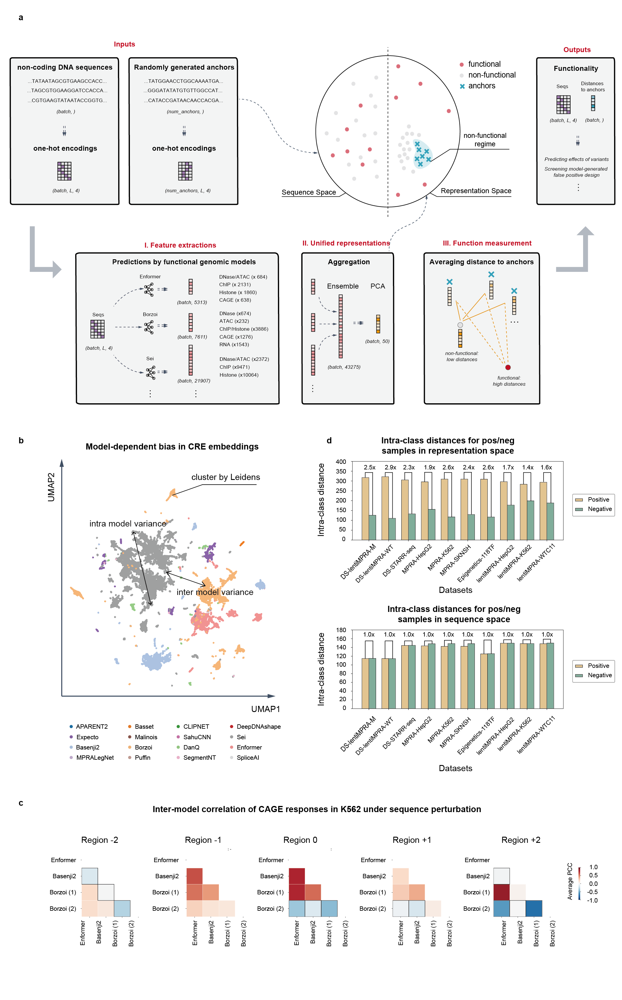
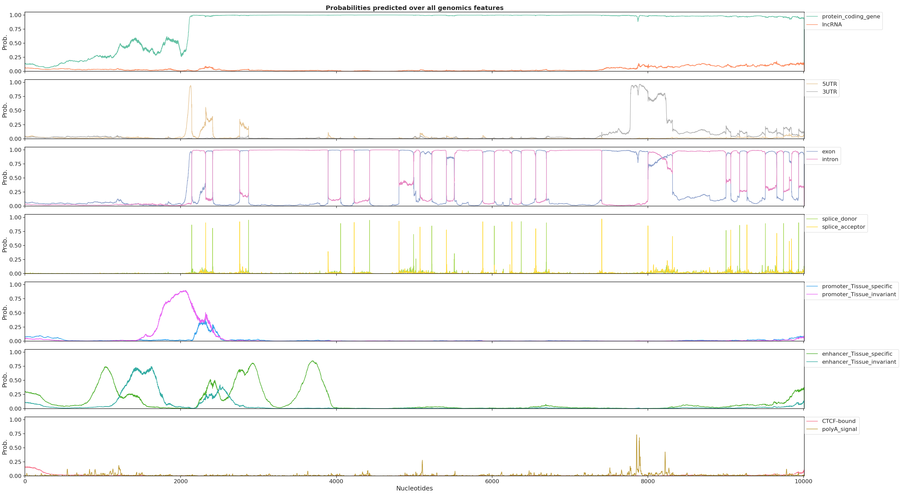

# DeepACE

*qxdu edited on May 11, 2026*

The code for computational implementation of "Anchor-based ensemble learning for assessing regulatory function of DNA sequences".

# Introduction

DeepACE (Deep Anchor-based Cis-regulatory Evaluation) is a deep learning–based framework that reinterprets 16 functional genomic models as complementary, semantically meaningful encodings of regulatory activity. DeepACE reveals a consistent geometric structure in which non-functional sequences collapse toward a compact regime, whereas functional sequences remain broadly distributed. Motivated by this asymmetry, DeepACE quantifies regulatory function as the distance from non-functional anchors, yielding a continuous, model-invariant metric without task-specific supervision. Consequently, DeepACE accurately captures the effects of sequence variation, distinguishes disease-associated variants, and eliminates non-functional synthetic candidates up to 16-fold more efficiently in sequence design tasks, while achieving leading performance across diverse benchmarking datasets and revealing interpretable functional directions within the regulatory landscape.



**Figure 1.** Figure 1: Overview of the DeepACE framework 

(a)	Schematic of the DeepACE approach. Input consists of raw DNA sequences, which are first transformed into functional representations by multiple functional genomics models (I). These representations are then integrated via ensemble modeling and projected through Principal Component Analysis (PCA) into a unified representation space (i.e., URS) (II). Finally, distances to randomly sampled non-functional anchor sequences are computed to quantify regulatory function in a model-invariant manner (III). DeepACE ultimately assigns each input sequence a distance-based score reflecting its regulatory activity.

(b)	Uniform Manifold Approximation and Projection (UMAP) of feature distributions for the same set of sequences across 16 predictive models (total n = 43,275), showing that each model encodes regulatory information in a distinct, model-specific manner. Colors correspond to different models as indicated in the legend.

(c)	Heatmap of cross-model correlations for predicted changes in K562 CAGE signal at the center position following 5-kb tile perturbations. Correlations were computed across predictive models based on the predicted center-position activity changes induced by each perturbation. Labels denote the perturbed tile’s offset relative to the sequence center (negative/left, 0/center, positive/right). The heatmap highlights the degree of agreement among models in capturing position-dependent regulatory effects across long-range perturbations.

(d)	Intra-class distances between functional and non-functional sequences (1:1 ratio) across 10 datasets. Top: DeepACE representation space, where distances are computed as Euclidean distances in URS. Bottom: original sequence space, where distances are computed using Levenshtein distance. Fold-change indicates how much larger the intra-class distance of functional sequences is relative to that of non-functional sequences.

# Quick Start

1. Predictions by functional geneomic models

2. Unified representation

3. Function measurement by anchor-based distances


## Predictions by functional geneomic models

We provide fully localized support for 16 functional genomic models published between 2016 and 2025. These models span highly heterogeneous software ecosystems, including incompatible conda environments, different PyTorch/TensorFlow versions, and diverse runtime dependencies. To make these models accessible within a unified framework, DeepACE introduces several layers of standardization and engineering integration:

- **Unified model wrappers.** All models are encapsulated into a consistent class interface, with their dependencies organized under the `./libs` directory, enabling direct import and streamlined usage.

- **Environment consolidation.** The original 16 heterogeneous runtime environments are reduced to only 5 unified environments (`./envs`). In particular, a single Lightning-based environment supports 11 different models.

- **Standardized weight management.** In collaboration with original model authors, we cleaned and reorganized model checkpoints, dependencies, and auxiliary files, retaining only the essential parameters required for inference.

- **Explicit nucleotide encoding conventions.** We systematically determined and documented the exact ATCG encoding order used by each model. Although this information is critical for correct inference and interpretation, it is often obscured by complex preprocessing pipelines in the original implementations.
- 
- **Structured output annotation.** We systematically reorganized model outputs and functional channels, allowing users to rapidly identify the biological semantics associated with any output feature from any model.

- **Built-in validation functions.** To ensure faithful reproduction, every model class includes a `quick_valid()` function. Each validation routine is linked to corresponding figures or statistical results from the original publication, allowing users to verify correct model loading and reproduction accuracy.

Detailed information for all 16 models is provided in the **Preparation** section.

Due to GitHub repository size limitations, some reproduction assets used by the `quick_valid()` functions are provided as external references. Two simple instances for verifying model behavior using the following resources:

- **SegmentNT.**  
  The original inference and visualization notebook is available at https://colab.research.google.com/#fileId=https%3A//huggingface.co/InstaDeepAI/segment_nt/blob/main/inference_segment_nt.ipynb. Our reproduced result can be found at valids dataset:
  

 

- **Enformer.**  
  For Enformer reproduction, we discussed the validation procedure with the authors of `basenji2-pytorch` and identified a practical validation benchmark discussed at https://github.com/d-laub/basenji2-pytorch/issues/1.

## Unified Representation

DeepACE integrates heterogeneous outputs from multiple functional genomic models into a shared representation space. A simplified pseudocode implementation is shown below:

```python
reps = concat(
    reps_enformer,
    reps_deepdnashape,
    ...,
    reps_puffin,
    reps_segmenNT
)

pca = PCA(n_components=50, random_state=42)
reps_pca = pca.fit_transform(reps)
```

## Function measurement by anchor-based distances

DeepACE quantifies regulatory function using anchor-based distance measurements. In practice, Mahalanobis distance is typically used to measure the distance between real sequence representations and randomly generated anchor representations, as Euclidean distance is insensitive to covariance structure in high-dimensional representation spaces.

A simplified pseudocode implementation is shown below:

```
cov = np.cov(pred_ref, rowvar=False)
cov_inv = np.linalg.pinv(cov)

sims = []

for x in pred_alt:
    dists = [-mahalanobis(x, y, cov_inv) for y in pred_ref]
    dists = np.array(dists)
    sims.append(dists.mean())

sims = np.array(sims)
sims = (sims - sims.min()) / (sims.max() - sims.min() + 1e-12)
```

Here, `pred_ref` denotes 50-dimensional embeddings of anchor-based non-functional sequences, while `pred_alt` denotes 50-dimensional embeddings of candidate regulatory sequences to be evaluated. The resulting normalized similarity score provides a continuous, model-invariant estimate of regulatory function.
